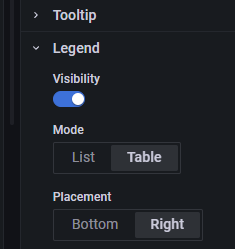

[How to load extension?](https://developer.chrome.com/docs/extensions/mv3/getstarted/development-basics/#load-unpacked) You might have to update the "matches" array in manifest.json.

This chrome/edge extension enables filtering the legends in grafana dashboards charts.

This adds a "Add Filters" button on top right. Once the charts are loaded, click the "Add Filters" button.

### Add Filter  

### Filters

### Filters Sample

# Limitation
1. The legend must be of mode Table

